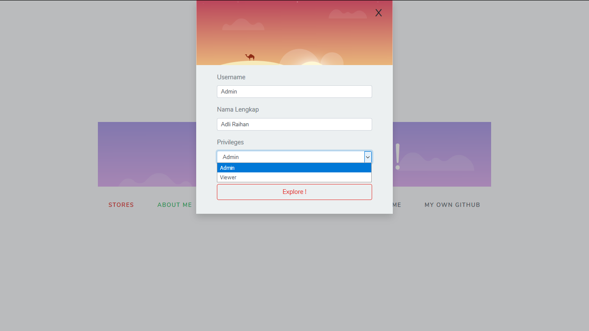
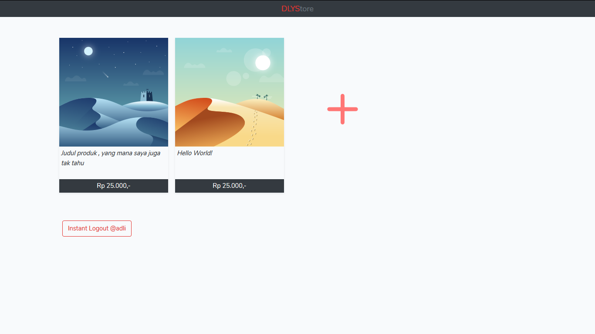
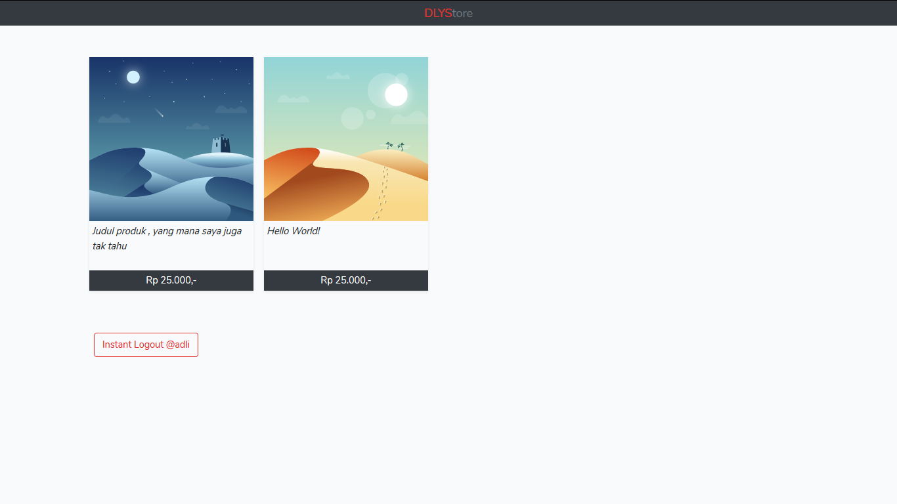
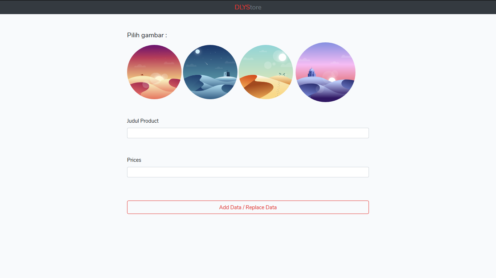

# [Laravel] Adding Items

<h2>About</h2>
Web Structure :
<ul>
    <li>Landing page</li>
    <li>Login Modal</li>
    <li>Lists Item View Page</li>
    <li>Add Item page</li>
</ul>

Web :
<ul>
    <li>3 Pages</li>
    <li>6 Route</li>
    <li>2 Costum Controller with 8 Function</li>
    <li>3 Middleware Rules</li>
</ul>

Frameworks yang dipakai :
<ul>
    <li> Laravel </li>
    <li> jQuery+ </li>
    <li> Bootstrap </li>
<ul>
    

<h2>Installation</h2>
<code>
    php artisan serve    
</code>
  

Homepage

Homepage + login moda

<h4>List Page [Role : Admin]</h4>

<h4>List Page [Role : Viewer]</h4>

<h4>Add Item Page</h4>

