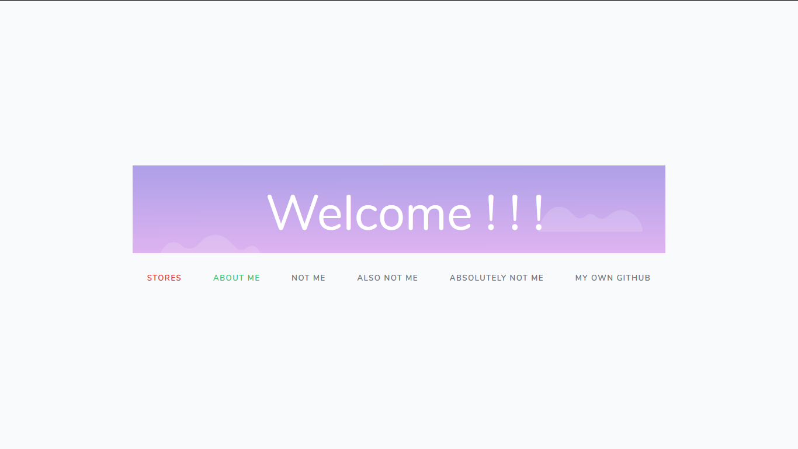

# [Laravel] Adding Items

 Web ini menggunakan cookies melakukan penambahan data , jika anda butuh versi database laravel bisa di cek di <a href="https://github.com/DNoir/Laravel-CRUD">sini</a>

<h2>About</h2>
Web Structure :
<ul>
    <li>Landing page</li>
    <li>Login Modal</li>
    <li>Lists Item View Page</li>
    <li>Add Item page</li>
</ul>

Web :
<ul>
    <li>3 Pages</li>
    <li>6 Route</li>
    <li>2 Costum Controller with 8 Function</li>
    <li>3 Middleware Rules</li>
</ul>

Frameworks yang dipakai :
<ul>
    <li> Laravel </li>
    <li> jQuery+ </li>
    <li> Bootstrap </li>
</ul>
    

<h2>Installation</h2>
oh iya anda jelas butuh requirement untuk menginstall laravel https://laravel.com/docs/5.7/installation , setelah itu baru open cmd dan ketikan 
<code>
    php artisan serve    
</code> 
 <i>Sebelumnya coba target dulu cd cmd ke folder laravelnya [jika blm paham]</i>
  

<h4>Homepage</h4>

<h4>Homepage + login modal</h4>

<h4>List Page [Role : Admin]</h4>

<h4>List Page [Role : Viewer]</h4>

<h4>Add Item Page</h4>

<code>
    jika ada pertanyaan bisa ditanyakan lewat email saya di adliraihan001@gmail.com
    </code>
